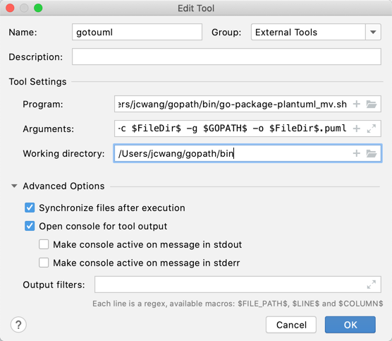

# Code

## [Go](#Go)

```
//centos
1. 下载需要的版本，有一些项目对Go版本有一定要求  https://golang.org/dl/
2. 对压缩包解压并安装，例如： rm -rf /usr/local/go && tar -C /usr/local -xzf go1.16.2.linux-amd64.tar.gz
3. 在/etc/profile中配置环境变量，如：
...
export GOPATH=/home/centos/gopath
export PATH=$PATH:$GOPATH:/usr/local/go/bin

4.设置代理(在较高版本都需要GOPROXY)
go env -w GOPROXY=https://goproxy.cn,direct
5.GO Modules配置
go env -w GO111MODULE=auto
 

5.查看go安装情况
go version
```
ref: [Go官网](https://golang.org/dl/)

## [godoc](#godoc)
```shell
//在Go1.12版本之后，就不再默认安装godoc工具了，需要自己手动安装
go get -u -v golang.org/x/tools/cmd/godoc
//启动godoc服务
godoc -http=:6060
```
我们会发现，开源的包会提供一些代码示例(Example)，这个在godoc文档中也会有体现。


## [GCC](#GCC)
```
//centos
sudo yum install -y gcc
```

## [dlv](#dlv)

dlv 的安装：
```shell
go get -u github.com/go-delve/delve/cmd/dlv
dlv version
```
在相应的源码路径下，使用dlv：
```
//可以远程调试main函数 
dlv debug --headless --listen=:2345 --api-version=2 [main]|[main.go] 
//对main函数可以添加参数
dlv debug --headless --listen=:2345 --api-version=2 [main]|[main.go] -- -param1 p1 -param2 p2
//可以远程调试测试文件
dlv  test --headless --listen=:2345 --api-version=2
//可以远程调试可执行文件,wd代表执行文件所执行所在的目录
dlv  --headless --listen=:2345 --api-version=2 exec ./executeable  (--wd  workspace)  -- -param1 p1 -param2 p2 
```
需要了解，
```shell
//因为我们使用dlv调试，所以需要构建的时候需要阻止Go的优化内联等操作
go build -gcflags \"all=-N -l\" github.com/app/demo  
```


## [graphviz](#graphviz)
`graphviz`是开源的图形可视化软件，可以将抽象信息进行可视化(如Go中的prof文件可以使用graphviz进行可视化；如puml文件可以通过graphviz进行可视化)。
[官方链接](http://www.graphviz.org/)
```
//Mac

```

## [Chrome MYSQL Admin](#mysql)
`Chrome MYSQL Admin`是一个轻量的Mysql客户端，还可以计算吞吐量，收发字节数等。
[官方链接](https://chrome.google.com/webstore/detail/chrome-mysql-admin/ndgnpnpakfcdjmpgmcaknimfgcldechn/related)


## [Goland](#goland)

Goland 插件列表

- [x] Docker
- [x] Kubernetes
- [x] Remote Hosts Access
- [x] PlantUML integration


### Docker 

需要在测试机让Docker可以远程连接TCP服务。在/etc/docker/daemon.json
```shell
{
 "hosts":[
    "tcp://0.0.0.0:2375"
  ],
 "registry-mirrors": ["http://f1361db2.m.daocloud.io"]
}
```
[相关参考](https://zhuanlan.zhihu.com/p/94224305)

### Kubernetes 

Market可以下载并且配置.kube/config文件，即可使用

### Remote Hosts Access

[相关参考1](https://blog.csdn.net/u013536232/article/details/104123861)
[相关参考2](https://blog.csdn.net/K346K346/article/details/105822846)
### PlantUML integration

PlantUML可以通过一种直观的语言来定义绘图的[开源项目](https://plantuml.com/zh/) 。

`go-package-plantuml`工具通过Go代码生成puml图。进行下载并安装：
```shell
go get github.com/wangjc0216/go-package-plantuml
```
因为`go-package-plantuml`通过`--outputfile`参数没有什么作用，所以只能通过使用脚本（先生成然后通过linux 命令 mv 来移动到指定的文件夹）
来进行使用。脚本如下：
```shell
//go-package-plantuml_mv.sh 
#!/bin/bash
while getopts ":c:g:o:" opt; do
    case "$opt" in
      c)
        CODEDIR=$OPTARG
        ;;
      g)
        GOPATH1=$OPTARG
        ;;
      o)
        OUTPUTFILE=$OPTARG
        ;;
    esac
done

echo $CODEDIR  $GOPATH1   $OUTPUTFILE

if [ "$CODEDIR" == "" ]; then
    echo "codedir is nil"
    exit 1
elif [ "$GOPATH1" == "" ]; then
    echo "gopath is nil"
    exit 1
elif [ "$OUTPUTFILE" == "" ]; then
    echo "outputfile is nil"
    exit 1
fi
echo $CODEDIR  $GOPATH1   $OUTPUTFILE

/Users/jcwang/gopath/bin/go-package-plantuml --codedir $CODEDIR  --gopath $GOPATH1 --outputfile  $OUTPUTFILE
mv /tmp/uml.txt  $OUTPUTFILE
```
在Reference/Tools/External Tools中安装gotouml工具，配置如下：



Paragrm: /Users/jcwang/gopath/bin/go-package-plantuml_mv.sh

Arguments: -c $FileDir$ -g $GOPATH$ -o $FileDir$.puml

Working Directory: /Users/jcwang/gopath/bin

配置完成后，在Go文件中右键External tool/gotouml 就可以生成本地目录的puml文件了。

`PlantUML integration`是一个将puml文件可视化的工具，但对于过于复杂的plantUml，会存在解析失败的问题，该插件直接在Market中安装就行。